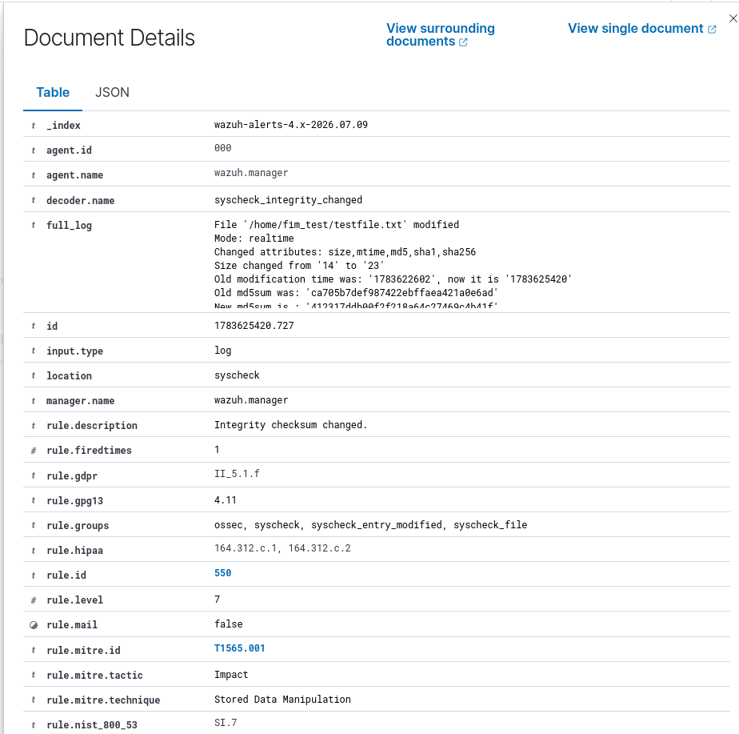

# Wazuh Detection Lab

A home SOC lab for hands-on detection engineering practice using Wazuh. This repo documents custom detection rules built, tested, and validated against simulated attack scenarios

## Objective

Simulate a realistic SSH brute-force attack against a lab target, then build, tune, and validate a custom Wazuh detection rule that fires on repeated authentication failures and correlates them against a successful login — closing the full attack-to-detection loop.

## Lab Architecture

| Component | Details |
|---|---|
| Wazuh Manager/Indexer/Dashboard | Docker single-node deployment,  |
| Host |  Ubuntu, 16GB RAM |
| Target | Ubuntu VM (SSH server) |


```
[Ubuntu/kali] --> [Ubuntu Target/window] --auth logs--> [Wazuh Agent ]
                                                                        |
                                                                        v
                                                              [Wazuh Manager (Ossec.conf)]
                                                                        |
                                                                        v
                                                               [Custom Rules (local_rules.xml)]
                                                                        |
                                                                        v
                                                              [Wazuh Dashboard Alert]
```
## Detection 1 : SSH Brute-force 

### Attack Simulation

A bash script using `sshpass` performs repeated failed SSH login attempts against the target, followed by one successful login using the correct credentials .

```bash
#!/bin/bash
# ssh_bruteforce_sim.sh
# Simulates SSH brute-force attempts followed by a successful login.
# For use only against systems you own/control in an isolated lab.

TARGET="192.168.x.x"
USER="Ayan"
WRONG_PASSWORDS=("password123" "admin123" "letmein" "qwerty123" "test1234")
CORRECT_PASSWORD="<Khan>"

for pass in "${WRONG_PASSWORDS[@]}"; do
    echo "[*] Trying password: $pass"
    sshpass -p "$pass" ssh -o StrictHostKeyChecking=no "$USER@$TARGET" exit
    sleep 1
done

echo "[*] Attempting correct login..."
sshpass -p "$CORRECT_PASSWORD" ssh -o StrictHostKeyChecking=no "$USER@$TARGET" exit
```


## Custom Detection Rule

`local_rules.xml` 

```xml
<group name="local,ssh_bruteforce,">
  <rule id="100010" level="10" frequency="5" timeframe="120">
    <if_matched_sid>5760</if_matched_sid>
    <description>SSH brute-force attempt detected: 5+ authentication failures from same source in 120 seconds</description>
    <mitre>
      <id>T1110.001</id>
    </mitre>
    <group>authentication_failures,pci_dss_10.2.4,pci_dss_10.2.5,</group>
  </rule>
</group>
```

**Logic:** the rule fires when 5 or more events matching base rule `5760` occur from the same source within a 120-second window — a frequency-based correlation rather than a single-event match, reducing false positives from occasional typos.


## Validation

1. Ran `sshpass`-driven failed login attempts against the target.
2. Confirmed each failure logged and matched against rule `5760` via `wazuh-logtest`.
3. Confirmed rule `100010` triggered after the 5th failure within the timeframe.
4. Followed with a successful login and confirmed the Wazuh Dashboard showed the full sequence: multiple `5760` alerts → `100010` correlation alert → successful auth event.


##  MITRE ATT&CK Mapping

| Technique | ID | Notes |
|---|---|---|
| Brute Force: Password Guessing | T1110.001 | Core technique simulated and detected |
| Valid Accounts | T1078 | Represented by the final successful login |


## Detection 2 : File integrity Monitoring (FIM)

FIM detects unauthorized or unexpected changes to files on monitored paths — creation, modification, deletion, or attribute changes — by tracking checksums and metadata over time. 

### Configuration
Added `/home/fim_test` as a monitored directory in `ossec.conf` (var/ossec/etc/ossec.conf) with realtime monitoring enabled:

```xml
<syscheck>
  <directories realtime="yes" report_changes="yes">/home/fim_test</directories>
</syscheck>
```

### Simulation
Modified a test file inside the monitored directory to trigger a checksum change:
Added a file & Deleted a file inside the monitered directory to trigger the alert

```bash
echo " MEHRAN KHAN " >> /home/fim_test/testfile.txt
```

### Detection 
1. Wazuh's `syscheck` picked up the change in realtime mode on `/home/fim_test/testfile.txt`.
2. The event was decoded by `syscheck_integrity_changed` and matched rule `550` ("Integrity checksum changed"), level 7.
3. The log confirmed the specific attributes that changed — size (14 → 23 bytes), modification time, and md5/sha1/sha256 checksums (old vs. new).
4. Confirmed the alert appeared in the Wazuh Dashboard with the correct rule, file path, and change details.



### MITRE ATT&CK Mapping

| Technique | ID | Notes |
|---|---|---|
| Stored Data Manipulation | T1565.001 | File content modified in a monitored path, detected via checksum/attribute change |


##  Next Steps

- **Success-after-failures rule**: a compound rule that specifically flags a successful login (base rule for successful SSH auth) occurring shortly after a `100010` alert from the same source — a stronger compromise indicator than failures alone.
- Add source IP threat-intel enrichment (e.g., via Wazuh's active response or an external feed).
- Extend to active response: auto-block source IP after `100010` fires.

## Repo Structure

```
.
├── README.md
├── scripts/
│   └── ssh_bruteforce_sim.sh
├── rules/
│   └── local_rules.xml
└── screenshots/
    ├── alert-100010.png
    └── attack-sequence.png
```

##  Environment

- Wazuh 4.14.5 (Docker single-node)
- Ubuntu (host + target)
- Kali vm
- windows vm
- `sshpass`

---
*Part of a home SOC lab built for hands-on detection engineering practice.*
